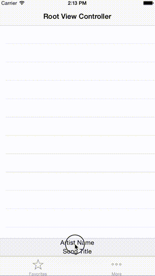

# MusicPlayerTransition

Custom interactive transition like Apple Music iOS App. written in Swift.

## Using Transition Animator

[ARNTransitionAnimator](https://github.com/xxxAIRINxxx/ARNTransitionAnimator)

## Requirements

* Xcode 7.0
* iOS 8.0+
* Swift 2.0

## License

MIT license. See the LICENSE file for more info.
